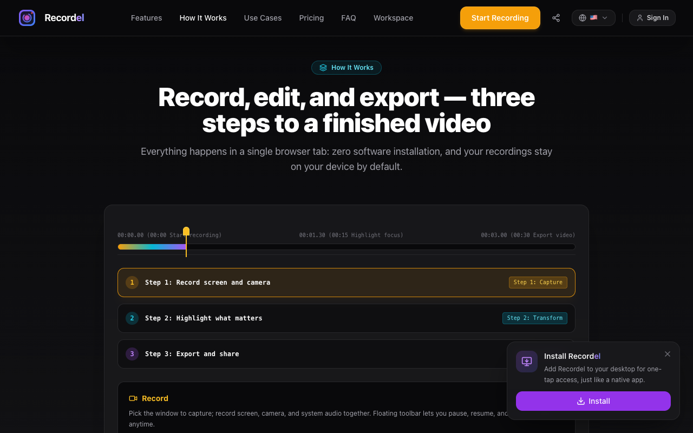
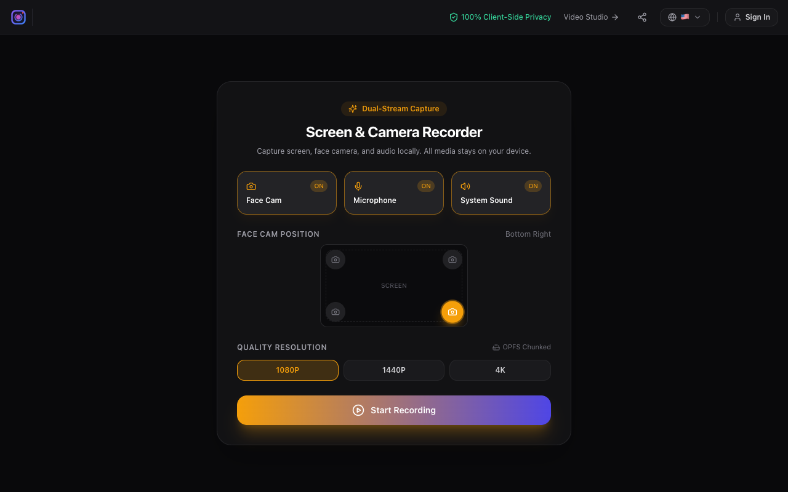
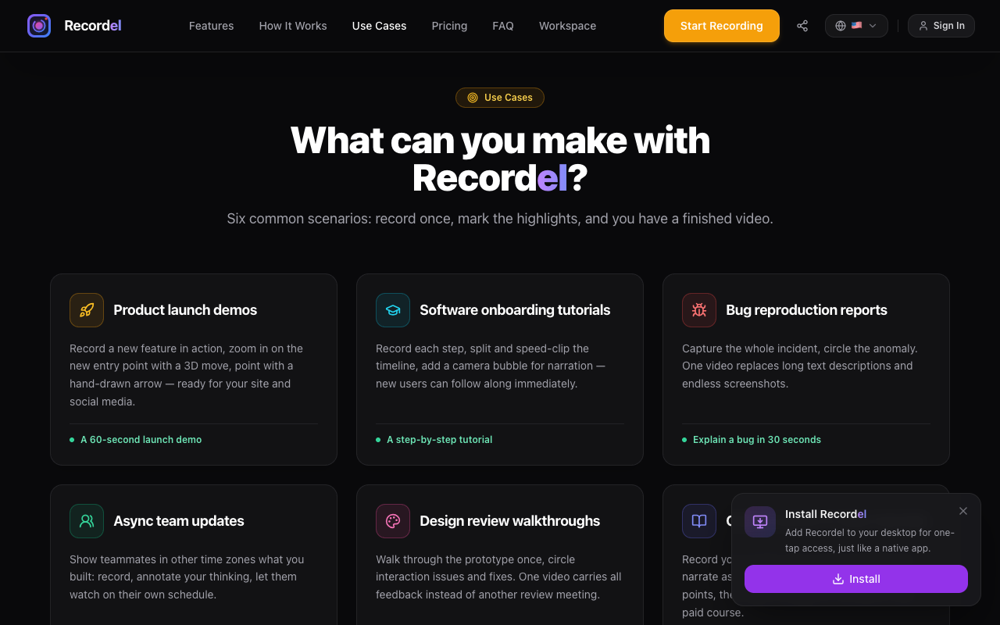

[English](README.md) | [简体中文](README.zh-CN.md) | [繁體中文](README.zh-TW.md) | [日本語](README.ja.md) | [한국어](README.ko.md) | [Español](README.es.md) | [Français](README.fr.md) | [Deutsch](README.de.md) | [Português](README.pt.md) | [Italiano](README.it.md) | [Русский](README.ru.md) | [Türkçe](README.tr.md) | [العربية](README.ar.md) | [हिन्दी](README.hi.md) | [Indonesia](README.id.md) | [Tiếng Việt](README.vi.md)

  

<h1 align="center">Recordel</h1>

  <strong>Yerleşik AI video editörü ile tarayıcı tabanlı ekran kaydı.</strong> 
  Ekranını, kameranı ve sesini kaydet — sonra doğal dille kurgula. Kurulum yok, yükleme yok.

  <a href="https://recordel.com">Web sitesi</a> ·
  <a href="https://recordel.com/recorder">Kaydediciyi aç</a> ·
  <a href="#-temel-özellikler">Özellikler</a> ·
  <a href="#-gizlilik--byok">Gizlilik</a> ·
  <a href="#-sss">SSS</a>

  

---

## ✨ Temel Özellikler

- **Tarayıcı tabanlı ekran kaydı** — ekran, kamera ve sistem sesini tek adımda yakala. Kurulum yok, her modern tarayıcıda çalışır.
- **Doğal dilde AI kurgu yardımcısı** — istediğin kurguyu tarif et («sessizlikleri kes, düğmeye zoom yap, altyazı ekle»), stüdyo kalitesinde sonuç al.
- **Sinema tarzı 3D kamera hareketleri** — herhangi bir klibi izometrik ön ayarlarla eğ ve döndür, gerçek bir kameraman gibi.
- **AI otomatik altyazı** — %100 yerel Whisper konuşma tanıma + AI yazım denetimi, tek tıkla altyazı ekleme.
- **0 token'lı yerel akıllı araçlar** — sessizlik kırpma ve tıklama zoom'u yerelde ve çevrimdışı çalışır, ücretsiz.
- **El çizimi tarzı açıklamalar** — eskiz oklar, konuşma balonları, spot ışıkları ve odak zoom'u ile dikkati yönlendir.
- **Çok kanallı kurgu** — ekran, kamera ve anlatım bağımsız kanallarda; her şeyi her zaman geri al.
- **Tasarım gereği %100 gizli** — kayıtların asla makineni terk etmez. Sunucuya hiçbir şey yüklenmez.
- **Hızlı dışa aktarma** — MP4 ve GIF saniyeler içinde, 4K'ya kadar.

## 📸 Ekran Görüntüleri

| | |
|---|---|
|  |  |

## 🚀 Başlangıç

1. **[recordel.com/recorder](https://recordel.com/recorder)** adresini aç — indirme yok, masaüstü uygulaması yok.
2. Neyi kaydedeceğini seç: tam ekran, bir pencere veya sekme — artı kamera ve ses.
3. Kaydet; sonra AI yardımcısıyla ya da çok kanallı zaman çizelgesinde elle kurgula.
4. MP4 veya GIF olarak dışa aktar ya da bağlantıyı paylaş.

## 🔒 Gizlilik ve BYOK

Recordel **local-first**'tir: kayıt, transkripsiyon (yerel Whisper) ve akıllı araçların tamamı kendi makinenizde çalışır — hiçbir şey yüklenmez.

AI kurgu için Recordel **BYOK (Bring Your Own Key)** destekler: DeepSeek, Claude veya OpenAI için kendi API anahtarlarınızı bağlayın ya da **Ollama** ile tamamen çevrimdışı çalışın.

## 💡 Kullanım Senaryoları

- 🎬 **Ürün demosu ve lansman** — Product Hunt, açılış sayfaları ve mağazalar için cilalı demo videolar
- 👩‍💻 **Mühendislik anlatımları** — kod incelemesi, hata raporları ve PR açıklamaları; zoom + açıklamalarla
- 📚 **Eğitimler ve kurslar** — otomatik altyazı, odak zoom, çok kanallı anlatım
- 🤝 **Asenkron ekip güncellemeleri** — bir toplantı daha planlamak yerine kaydet

## ❓ SSS

**Bir şey kurmam gerekiyor mu?**
Hayır. Kayıt ve kurgu tamamen tarayıcıda çalışır.

**Kayıtlarım nereye gidiyor?**
Hiçbir yere. Dosyalar cihazınızda kalır — Recordel medyanızı yüklemez.

**Hangi AI sağlayıcıları destekleniyor?**
Kendi API anahtarınızla (BYOK) DeepSeek, Claude, OpenAI; ya da Ollama ile tamamen çevrimdışı.

## 🔗 Bağlantılar

- 🌐 Web sitesi: [recordel.com](https://recordel.com)
- 🎥 Kaydedici: [recordel.com/recorder](https://recordel.com/recorder)

## 📄 Lisans

Bu depodaki içerikler (metin, görsel) yalnızca bilgilendirme amaçlıdır.
Recordel'in kendisi kapalı kaynaklı bir üründür — ayrıntılar için [recordel.com](https://recordel.com).
